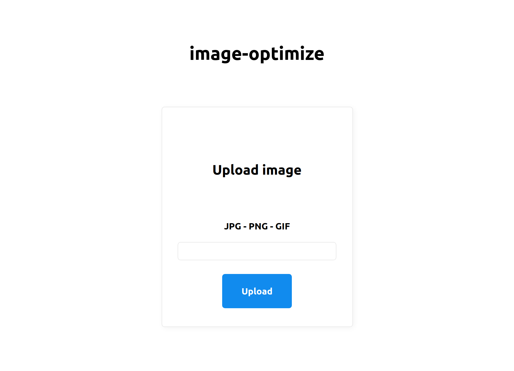

# image-optimize

**[image-optimize](image-optimize.seongmin.dev)** is online image optimizer.

## Optimization tools

It uses following tools to optimize image.

- JPEG  
  [MozJPEG](https://github.com/mozilla/mozjpeg)
- PNG  
  [pngquant](https://github.com/kornelski/pngquant), [Oxipng](https://github.com/shssoichiro/oxipng)
- GIF  
  [Gifsicle](https://github.com/kohler/gifsicle)

## Screenshot

